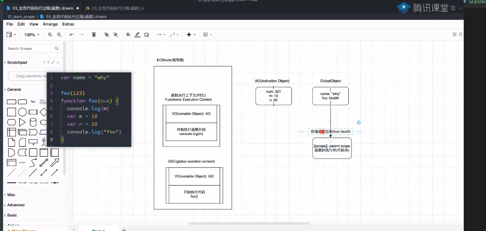
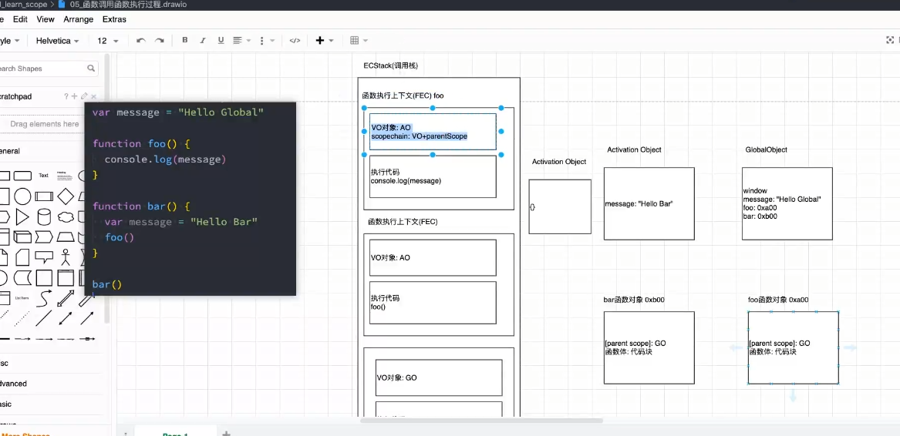
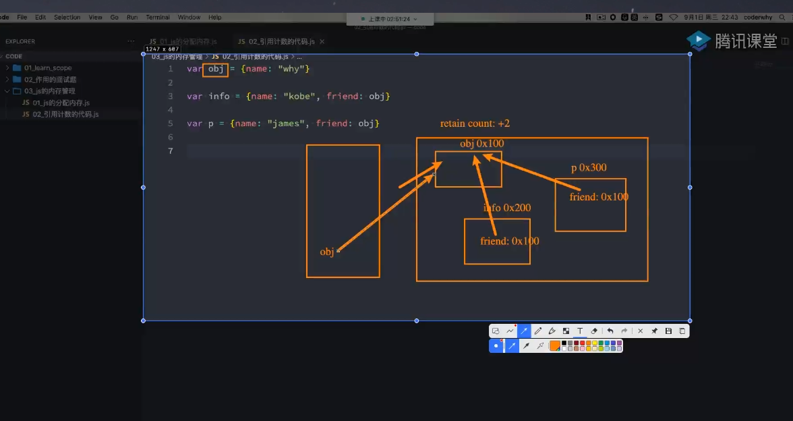
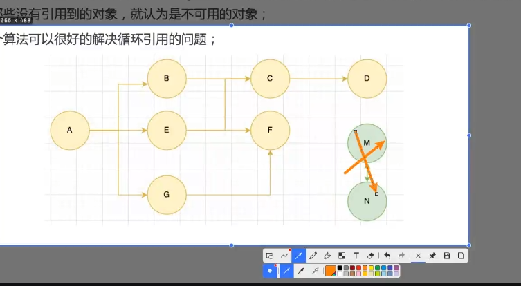

# 作用域
## 函数作用域

```js
// 在编译的时候就会被创建FEC
foo()  //普通函数会出函数变量提升

function foo(){
    console.log(num)  //undefined
    var num = 10
    console.log("foo")
}
foo()


```

- 当我查找一个变量的时候，真实的查找路径是沿着作用域链来查找的 
- 经典面试题
```js
var message="111"
function foo(){
    console.log(message)   // 111
}
function bar(){
    var message = '222'
    foo()
}
bar()

// 

function foo(){
    var a=b=10
}
foo()
console.log(a)
console.log(b)

//
function foo(){
    console.log(a)
    return 
    var a=10
}
foo()


```

## 内存管理
1. 不管什么编程语言，在代码执行过程中都需要给他分配内存的，不同的是某些编程语言需要我们自己手动的管理内存，某些编程语言会可以自动帮助我们管理内存
2. 不管什么样的方式来管理内存，内存的管理都会有如下的生命周期
 - 分配申请你需要的内存(申请)
 - 使用分配的内存(存放一些东西，比如对象)
 - 不需要使用的时候，对其就行释放
3. JavaScript分配内存
 - js对于基本数据类型内存的分配会在执行时，直接在栈空间进行分配
 - js对于复杂数据类型内存的分配会在堆内存中开辟一块空间，并且将这块空间的指针返回值变量引用

 ## js的垃圾回收
 1. 因为内存的大小是有限的，所以当内存不再需要的时候，我们需要对其进行释放，以便腾出更多额内存空间
 2. 在手动的管理内存,我们需要手动的方式来释放不再需要的内存，如free函数
  - 但是这种方式效率非常的低，影响我们写代码的消息
  - 并且这种方式对开发者的要求很高，并且一不小心就会产生内存泄漏
3. 所以大部分现代的编程语言都时有自己的垃圾回收机制
 - 垃圾回收的简称为GC
 - 对于那些不需要再使用的对象，我们简称为垃圾，是会需要被回收的，以释放更多的内存
 - 而对于我们的语言运行环境，比如JAVA的运行环境JVM，js的运行引擎都会内存垃圾回收器
 - 垃圾回收器我们也会简称为GC，所以在很多地方看到的GC其实指的时垃圾回收器
4. 常用算法
 - 引用计数法 (弊端：循环引用)
 
 - 标记清除
  - 设置一个根对象(root object) 垃圾回收器会定期从根开始，找所有从跟对象开始引用的对象，对于那些没有引用的对象，就会认为时不可以对象
  - 可以有效的解决循环引用问题
   
