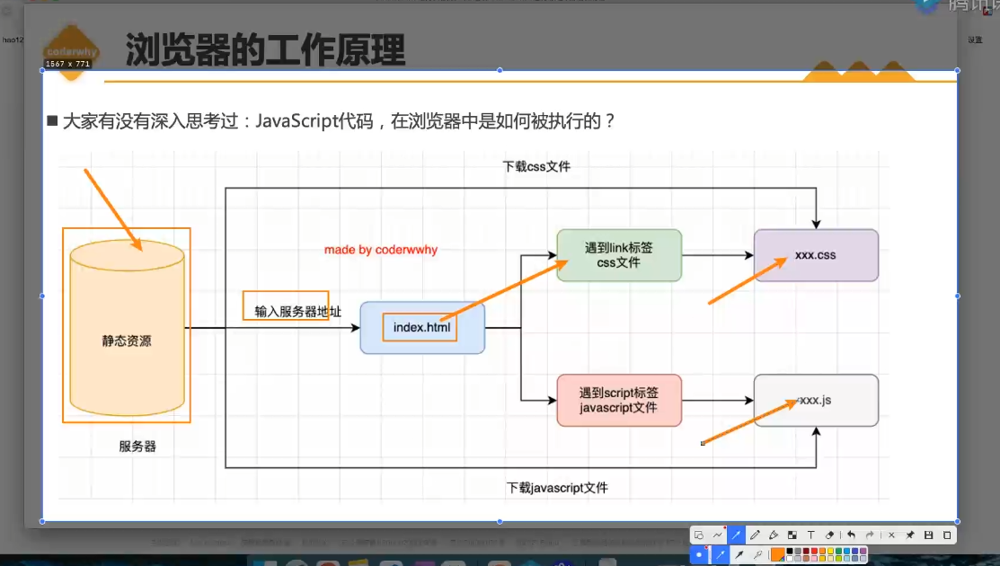
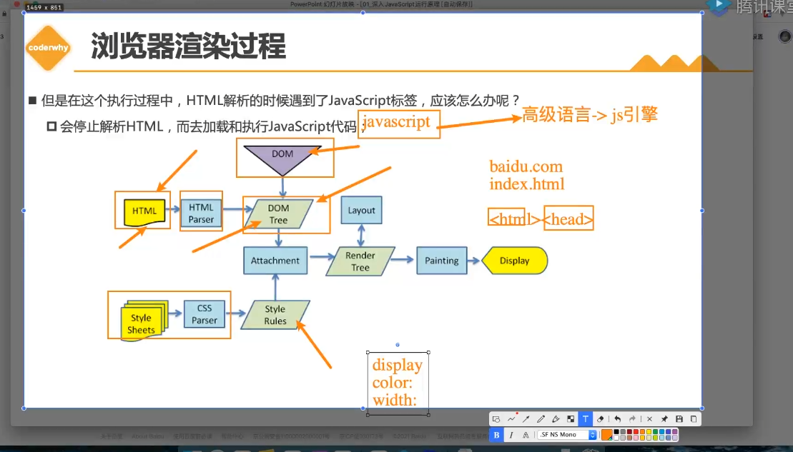
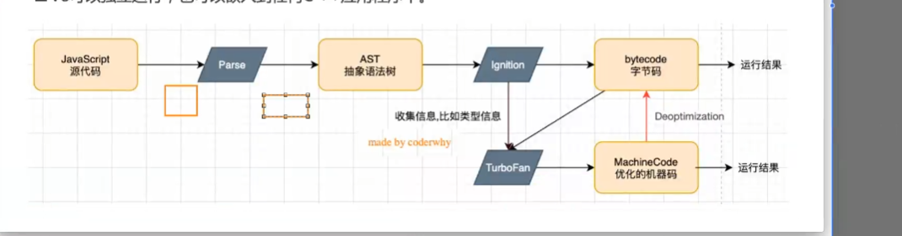
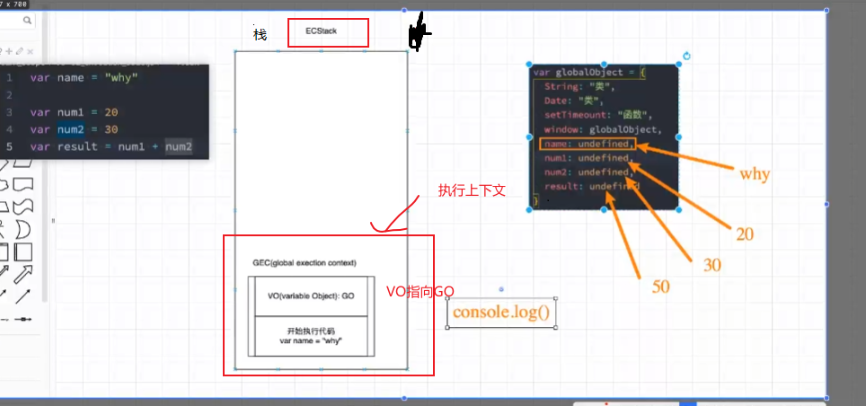

# 认识js
## js的发展的三个阶段
1. 机器语言
2. 汇编语言
3. 高级语言

## JavaScript 是如何被浏览器执行的
1.  输入域名通过dns解析为ip地址会请求服务器返回index.html


## 认识浏览器内核
1. Gecko   浏览器 Firefox
2. Trident  微软开发 被ie4~ie11 使用 
3. Webkit   用于Safair 已经早期的Google
4. Blink  用于Google Chrome Edge Opera等

## 浏览器渲染过程


## 认识JavaScript引擎


## JavaScript的执行顺序
1. js引擎会在执行代码前，会在堆内存中创建一个全局对象：Global Object (GO)
  - 该对象的所有作用域(scope)都可以访问
  - 里面还会包含Date，setTimeout，String，Number
  - 其中还会有一个window属性指向自己
  ```js
  var name = 'lili'
  console.log(num1) //undefined
  var num1= 20;
  var num2 = 30
  var result = num1+num2

  var GlobalObject = {
      Date:'类',
      String:'类',
      setTimeout:'函数',
      window:GlobalObject, // 指向自己
      name:undefined,
       num1:undefined,
       num2:undefined,
      result:undefined,
  }
  ```
  
2. js引擎内部还有一个执行上下文栈，他是用于执行代码的调用栈
 - 全局的代码块为了执行会构建一个GEC
 - GEC会被放到ECS中执行
