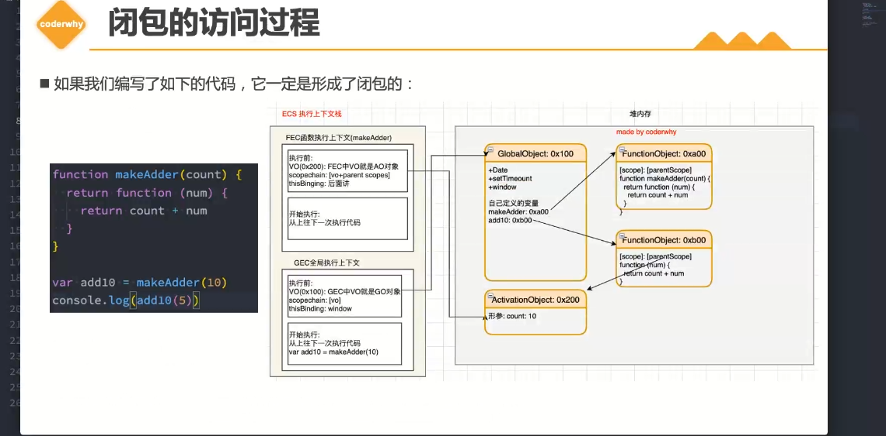
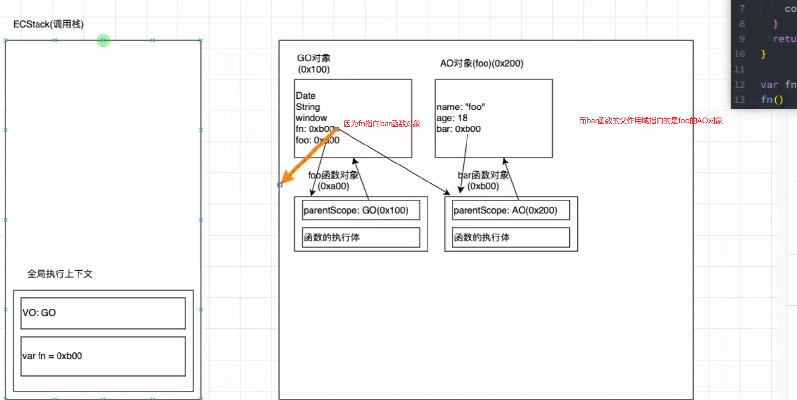

# 闭包的认识
## 闭包的定义
1. 再计算机科学中
 - 闭包，又称词法闭包或函数闭包
 - 是在支持头等函数的编程语言中，实现词法绑定的一种技术
 - 闭包在实现上是一个结构体，它储存了一个函数和一个关联的环境(相当于一个符号查找表)
 - 闭包和函数最大的区别在于，当捕捉闭包的时候，他的自由变量时会在捕获被确定，即使脱离了捕捉时候的上下文，他也能照常运行
2. 在JavaScript的理解
- 一个函数和其周围状态的引用捆绑在一起(或者说函数被引用包围)，这就是闭包
- 也就是说，闭包可以让你在一个函数内层中访问到其函数外层函数的作用域
- 在JavaScript中，每创建一个函数，闭包就会在函数创建的同时被创建出来
```JS
function foo(){
    var name = "foo"
    function bar(){
        console.log('bar',name)
    }
    return bar
}
var fn = foo()
fn()
```
3.理解
 - 一个普通的函数，如果它可以访问外层作用于的自由变量，那么他就是一个闭包
 - 从广义的角度：js都是闭包
 - 从狭义的角度：当一个函数访问了外层作用域的自由的变量，他才是闭包

## 闭包的内存泄露
