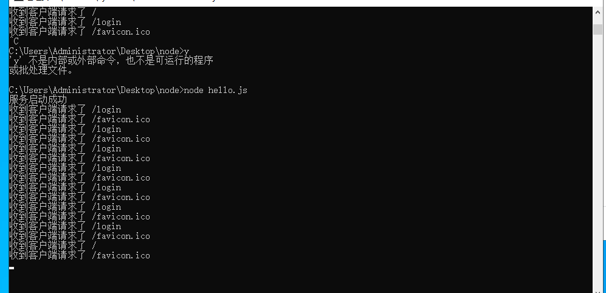

# HTTP
- http 主要是的职责是帮你创建编写一个服务器
## 价值http核心模块
```js
var http = require('http')
//使用http.createServer()方法创建一个Web服务器
var server = http.createServer()
//当服务端请求过来，就会触发服务器的requset请求事件，然后执行第二个参数，进行回调处理
/**
 * Requset  请求对象
 *   请求对象可以获取客户端的一些请求信息，如请求路径
 * 
 * Response 响应对象
 *   响应对象可以用来给客户端发送响应消息
 */

server.on('request', (requset, response) => {
    console.log('收到客户端请求了', requset.url)
    //response 对象有一个方法：write可以来给客户端发送数据 ，但结尾一定要用end来结束，不然客户端会一直等待
    // switch (requset.url) {
    //     case '/login':
    //         response.write('hello')
    //         response.end()
    //         break;
    //     case '/gin':
    //         response.write('hello1111')
    //         response.end()
    //         break;
    //     default:
    //         response.write('79999')
    //         response.end()
    //         break;
    // }
    //简写方法

    //   response.end('我是简写')
    // 响应数据只能是二进制 ，对象，数据,数子,布尔值,都不可以
    if (requset.url == '/login') {
        let products = [
            {
                name: '无敌',
                id: '1'
            },
            {
                name: '无敌',
                id: '2'
            },
            {
                name: '无敌',
                id: '3'
            }
        ]
        //解决文本类型
        response.setHeader('Content-Type','text/plain;charset=utf-8')
        response.end(JSON.stringify(products))
    } else {
        console.log('请求错误');
    }

})
//绑定端口号，启动服务器
server.listen(3000, () => {
    console.log('服务启动成功')
})
```


### node中js
1. 没用DOM BOM
2. Node 为js提供了很多服务器级别的API 如fs模块,http模块，path模块，os模块
3. 只要说这个模块是核心模块就必须
```js
var fs = require('fs')
var http =require('http')
```
4. node 没用全局作用域，只有模块作用域 

5. Content-Type对应关系查询网站[https://tool.oschina.net/](https://tool.oschina.net/)