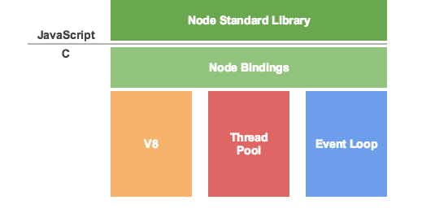

#  node学习
## 什么是node
1. Node.js不是一门语言也不是框架，而是基于谷歌V8引擎的JavaScript运行时环境，同时结合Libuv扩展了JaveScript功能，使之支持io，fs等只有语言才有的特征，使JavaScript能同时具有DOM操作和I/O，文件duxie，操作数据库(服务端)等能力，是目前最简单的全栈式语言。
## 基本原理
> Node.js由事件循环(vent Loop)分发I/o人，最终工作先出(Work Thred)将任务丢掉线程池(Thredad Pool)里去执行。而事件循环只要等待执行结果就可以了
> 

## Node.js的特点
- 事件驱动
- 非阻塞IO模型(异步)
- 轻量和高效