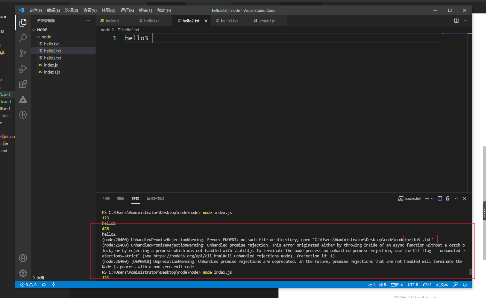

# 模块导入和导出
- Node.js采用的是Commonjs的规范
### 
1. 导入 requir 
2. 导出 exports 只能设置单独的属性
3.  module.exports  可以单独设置属性也可整个赋值
```javascript
module.exports =function(){
    console.log('我导出了')
}

const a = requir('文件路径')

```

# 进行fs操作(文件的读写)

1. API 地址 http://nodejs.cn/api/
### 文件的读取
```javascript
//导入fs 文件模块

var fs = require('fs')

//同步方式
var fn = fs.readFileSync('hello.txt',{flag:'r',encoding:'utf-8'})

//异步方法
fs.readFile('hello.txt',{flag:'r',encoding:'utf-8'},(err,data)=>{
   if(err){
       console.log(err)

   }else{
       console.log(data)
   }
   console.log(456)
})
console.log(123)
//简单的封装
function fsRead(url,option){
    return new Promise((resolve,reject)=>{
        fs.readFile(url,option,(err,data)=>{
            if(err){
                reject(err)
            }else{
                resolve(data)
            }
        })
    })
}

let option = {
    flag:'r',//读
    encoding:'utf-8' //解析的编码格式
}
fsRead('hello.txt',option).then(res=>{
    console.log(res)
})
// console.log()

//当读入文件里面的文件

async function redList(){
   const file1 = await fsRead('hello.txt',option)
   const file2 = await fsRead(file1.trim()+'.txt',option)
   const file3 = await fsRead(file2.trim()+'.txt',option)
   console.log(file3)
}
redList()
```


>注意可能出错的地方

1. 当文件内容出现空格等字符会出现以下问题

### 文件的写入
```javascript
let fs = require('fs')
// 当flag为r时，会覆盖文件的内容,当为a时会添加
fs.writeFile('hello.txt','你聊天吗?\n',{flag:'a',encoding:'utf-8'},err=>{
    if(err){
        console.log(err)
    }else{
        console.log('写入成功')
    }
})

//简单的封装
function writeList(path,conent,option){
    return new Promise((resolve,reject)=>{
      fs.writeFile(path,conent,option,err=>{
        if(err){
            reject(err)
        }else{
            resolve('写入成功')
        }
      })  
    })
}
let content  = '你聊天吗?\n'
let option={flag:'a',encoding:'utf-8'}
async function getList(){
    const write  = await writeList('hello.txt',content,option)
   console.log(write)
}
getList()
```